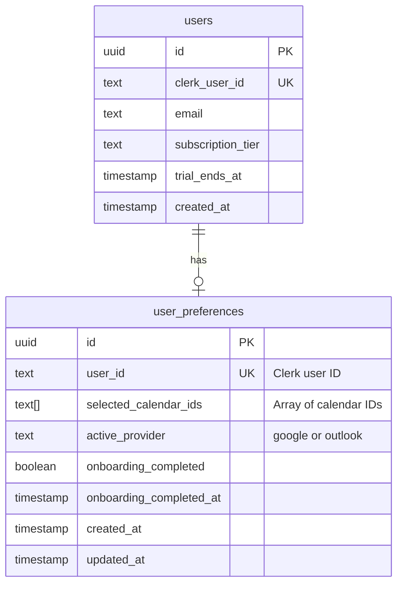

# Feature: Improve Onboarding Experience

**Date**: 2025-12-16
**Branch**: `staging/improve_onboarding`
**Deploys to**: calfix-new.vercel.app

---

## Overview

This plan addresses three interconnected improvements to the CalFix user experience:

1. **First-Time User Onboarding Flow** - Guide new users through calendar connection and setup
2. **Settings Page with Calendar Selection** - Allow EA/Pro users to select their 5/15 calendars
3. **Remove Dashboard Calendar Selector Flicker** - Fix loading state that causes UI flicker

**Recommendation**: Implement as **three separate PRs** in sequence, as they build upon each other:
- PR 1: Settings Page + Database Schema (foundation)
- PR 2: Onboarding Flow (depends on settings page structure)
- PR 3: Dashboard Flicker Fix (depends on onboarding redirect logic)

---

## Current State Analysis

### What Exists Today

| Component | Status | Location |
|-----------|--------|----------|
| Onboarding Flow | ❌ None | N/A |
| Settings Page | ❌ None | N/A |
| Calendar Selection | ⚠️ localStorage only | `src/hooks/useCalendarSelection.ts` |
| User Preferences Table | ❌ None | N/A |
| Multi-Calendar Support | ⚠️ Partial | Dropdown exists but limited |

### Current User Journey (Problem)

```
Sign Up → Dashboard → ProviderSelection inline → OAuth → Dashboard (with flicker)
                                                              ↑
                                               No guidance, no setup wizard
```

### Key Files Reference

- **Dashboard**: `src/components/CalendarDashboard.tsx:1110-1136` (loading states)
- **Calendar Selector**: `src/components/shared/CalendarSelectorCard.tsx:42-52` (filter logic)
- **Selection Hook**: `src/hooks/useCalendarSelection.ts:26-38` (localStorage)
- **Subscription API**: `api/user/subscription.ts:79-96` (tier limits)
- **Provider Context**: `src/context/CalendarProviderContext.tsx:103-131` (OAuth check)
- **Routes**: `src/App.tsx` (no /settings or /onboarding routes)

### Subscription Tier Limits (from `api/user/subscription.ts:79-96`)

| Tier | Max Calendars | Multi-Calendar Access |
|------|--------------|----------------------|
| `basic` | 1 | No |
| `ea` (EA Basic) | 5 | Yes |
| `ea_pro` (EA Pro) | 15 | Yes |

---

## PR 1: Settings Page + Database Foundation

### Problem Statement

Users have no way to:
- Select which calendars they want to manage (EA/Pro tiers)
- Persist calendar selection across devices (currently localStorage only)
- View or change account preferences

The "Preferences" button in CalendarSelectorCard (`src/components/shared/CalendarSelectorCard.tsx:29,69,290`) has no implementation.

### Proposed Solution

Create a Settings page at `/settings` with:
1. Calendar Selection section (slot-based selection UI)
2. Persistent storage via Supabase `user_preferences` table
3. Server-side validation of tier limits

### Technical Approach

#### Database Schema

> **NOTE:** The `user_preferences` table already exists with columns for `home_location`, `business_hours`, `notification_preferences`, `auto_dismiss_alerts`, and `theme`. We only need to ADD the missing columns.

**File: `supabase/migrations/YYYYMMDD_HHMMSS_add_onboarding_columns.sql`**

```sql
-- Add calendar selection and onboarding columns to existing user_preferences table
-- The table already exists with: user_id, home_location, business_hours, notification_preferences, auto_dismiss_alerts, theme

-- Add calendar selection columns
ALTER TABLE user_preferences
  ADD COLUMN IF NOT EXISTS selected_calendar_ids TEXT[] DEFAULT '{}',
  ADD COLUMN IF NOT EXISTS active_provider TEXT DEFAULT 'google';

-- Add onboarding tracking columns
ALTER TABLE user_preferences
  ADD COLUMN IF NOT EXISTS onboarding_completed BOOLEAN DEFAULT FALSE,
  ADD COLUMN IF NOT EXISTS onboarding_completed_at TIMESTAMPTZ;

-- Add check constraint for active_provider
ALTER TABLE user_preferences
  ADD CONSTRAINT active_provider_check
  CHECK (active_provider IN ('google', 'outlook'));

-- Note: RLS is already enabled on user_preferences table
-- Note: updated_at trigger may already exist - check before creating
```

**Existing related tables (no changes needed):**
- `managed_calendars` - tracks calendars users have delegate access to (12 rows)
- `calendar_delegate_access` - tracks delegate calendar permissions (10 rows)

#### API Endpoint

**File: `api/user/preferences.ts`**

```typescript
import { createClient } from '@supabase/supabase-js';
import { auth } from '@clerk/nextjs/server';

interface UserPreferences {
  selected_calendar_ids: string[];
  active_provider: 'google' | 'outlook';
  onboarding_completed: boolean;
}

// GET /api/user/preferences
export async function GET(request: Request) {
  const { userId } = auth();
  if (!userId) return Response.json({ error: 'Unauthorized' }, { status: 401 });

  const supabase = createClient(/* ... with service role for RLS bypass */);

  const { data, error } = await supabase
    .from('user_preferences')
    .select('*')
    .eq('user_id', userId)
    .single();

  if (error && error.code !== 'PGRST116') {
    return Response.json({ error: error.message }, { status: 500 });
  }

  return Response.json(data || { selected_calendar_ids: [], active_provider: 'google' });
}

// PUT /api/user/preferences
export async function PUT(request: Request) {
  const { userId } = auth();
  if (!userId) return Response.json({ error: 'Unauthorized' }, { status: 401 });

  const body = await request.json();
  const { selected_calendar_ids, active_provider, onboarding_completed } = body;

  // Fetch subscription to validate limits
  const subscriptionResponse = await fetch(`${process.env.NEXT_PUBLIC_URL}/api/user/subscription`, {
    headers: { Authorization: request.headers.get('Authorization') || '' }
  });
  const subscription = await subscriptionResponse.json();

  // SERVER-SIDE VALIDATION: Enforce tier limits
  if (selected_calendar_ids && selected_calendar_ids.length > subscription.maxCalendars) {
    return Response.json({
      error: `Your plan allows ${subscription.maxCalendars} calendars. You selected ${selected_calendar_ids.length}.`
    }, { status: 400 });
  }

  const supabase = createClient(/* ... */);

  const { data, error } = await supabase
    .from('user_preferences')
    .upsert({
      user_id: userId,
      selected_calendar_ids: selected_calendar_ids || [],
      active_provider: active_provider || 'google',
      onboarding_completed: onboarding_completed ?? false,
      onboarding_completed_at: onboarding_completed ? new Date().toISOString() : null,
    })
    .select()
    .single();

  if (error) {
    return Response.json({ error: error.message }, { status: 500 });
  }

  return Response.json(data);
}
```

#### Settings Page Component

**File: `src/pages/SettingsPage.tsx`**

```tsx
import { useState, useEffect } from 'react';
import { useAuth } from '@clerk/clerk-react';
import { useSubscription } from '../context/SubscriptionContext';
import { useCalendarProvider } from '../context/CalendarProviderContext';

interface Calendar {
  id: string;
  summary: string;
  description?: string;
  accessRole: string;
  primary?: boolean;
}

export default function SettingsPage() {
  const { getToken } = useAuth();
  const { subscription } = useSubscription();
  const { fetchCalendars, activeProviderId } = useCalendarProvider();

  const [calendars, setCalendars] = useState<Calendar[]>([]);
  const [selectedIds, setSelectedIds] = useState<string[]>([]);
  const [loading, setLoading] = useState(true);
  const [saving, setSaving] = useState(false);
  const [error, setError] = useState<string | null>(null);

  const maxCalendars = subscription?.maxCalendars || 1;
  const hasMultiCalendarAccess = subscription?.hasMultiCalendarAccess || false;

  // Fetch current preferences and calendars on mount
  useEffect(() => {
    async function loadData() {
      try {
        const token = await getToken();

        // Fetch preferences from Supabase
        const prefsResponse = await fetch('/api/user/preferences', {
          headers: { Authorization: `Bearer ${token}` }
        });
        const prefs = await prefsResponse.json();

        // Fetch available calendars from provider
        const calendarList = await fetchCalendars();

        // Filter to manageable calendars
        const manageable = calendarList.filter((cal: Calendar) =>
          ['owner', 'writer'].includes(cal.accessRole) &&
          !cal.id.includes('.resource.calendar.google.com')
        );

        setCalendars(manageable);
        setSelectedIds(prefs.selected_calendar_ids || []);
      } catch (err) {
        setError('Failed to load settings');
      } finally {
        setLoading(false);
      }
    }

    loadData();
  }, []);

  const handleToggleCalendar = (calendarId: string) => {
    setSelectedIds(prev => {
      if (prev.includes(calendarId)) {
        return prev.filter(id => id !== calendarId);
      }
      if (prev.length >= maxCalendars) {
        return prev; // Already at limit
      }
      return [...prev, calendarId];
    });
  };

  const handleSave = async () => {
    setSaving(true);
    setError(null);

    try {
      const token = await getToken();
      const response = await fetch('/api/user/preferences', {
        method: 'PUT',
        headers: {
          'Content-Type': 'application/json',
          Authorization: `Bearer ${token}`
        },
        body: JSON.stringify({
          selected_calendar_ids: selectedIds,
          active_provider: activeProviderId
        })
      });

      if (!response.ok) {
        const data = await response.json();
        throw new Error(data.error || 'Failed to save');
      }

      // Success feedback
      // TODO: Add toast notification
    } catch (err: any) {
      setError(err.message);
    } finally {
      setSaving(false);
    }
  };

  if (loading) {
    return <SettingsPageSkeleton />;
  }

  return (
    <div className="max-w-3xl mx-auto px-4 py-8">
      <h1 className="text-2xl font-bold text-gray-900 mb-8">Settings</h1>

      {/* Calendar Selection Section */}
      <section className="bg-white rounded-lg shadow p-6 mb-6">
        <div className="flex items-center justify-between mb-4">
          <h2 className="text-lg font-semibold text-gray-900">Calendar Selection</h2>
          <span className="text-sm text-gray-500">
            {selectedIds.length} of {maxCalendars} selected
          </span>
        </div>

        {!hasMultiCalendarAccess && (
          <div className="mb-4 p-3 bg-blue-50 border border-blue-200 rounded-lg">
            <p className="text-sm text-blue-800">
              Upgrade to EA Basic or Pro to manage multiple calendars.
            </p>
          </div>
        )}

        <div className="space-y-3">
          {calendars.map(calendar => {
            const isSelected = selectedIds.includes(calendar.id);
            const isDisabled = !isSelected && selectedIds.length >= maxCalendars;

            return (
              <label
                key={calendar.id}
                className={`
                  flex items-center p-4 rounded-lg border-2 cursor-pointer
                  transition-all duration-200
                  ${isSelected
                    ? 'border-blue-600 bg-blue-50'
                    : 'border-gray-200 hover:border-gray-300'}
                  ${isDisabled ? 'opacity-50 cursor-not-allowed' : ''}
                `}
              >
                <input
                  type="checkbox"
                  checked={isSelected}
                  disabled={isDisabled}
                  onChange={() => handleToggleCalendar(calendar.id)}
                  className="sr-only"
                />
                <div className={`
                  w-5 h-5 rounded border-2 mr-4 flex items-center justify-center
                  ${isSelected ? 'bg-blue-600 border-blue-600' : 'border-gray-300'}
                `}>
                  {isSelected && (
                    <svg className="w-3 h-3 text-white" fill="currentColor" viewBox="0 0 20 20">
                      <path fillRule="evenodd" d="M16.707 5.293a1 1 0 010 1.414l-8 8a1 1 0 01-1.414 0l-4-4a1 1 0 011.414-1.414L8 12.586l7.293-7.293a1 1 0 011.414 0z" clipRule="evenodd" />
                    </svg>
                  )}
                </div>
                <div className="flex-1">
                  <p className="font-medium text-gray-900">
                    {calendar.summary}
                    {calendar.primary && (
                      <span className="ml-2 text-xs bg-gray-100 text-gray-600 px-2 py-0.5 rounded">
                        Primary
                      </span>
                    )}
                  </p>
                  {calendar.description && (
                    <p className="text-sm text-gray-500 mt-0.5">{calendar.description}</p>
                  )}
                </div>
              </label>
            );
          })}
        </div>

        {error && (
          <div className="mt-4 p-3 bg-red-50 border border-red-200 rounded-lg">
            <p className="text-sm text-red-800">{error}</p>
          </div>
        )}

        <div className="mt-6 flex justify-end">
          <button
            onClick={handleSave}
            disabled={saving}
            className={`
              px-6 py-2 rounded-lg font-medium
              transition-all duration-200
              ${saving
                ? 'bg-gray-300 cursor-not-allowed'
                : 'bg-blue-600 hover:bg-blue-700 text-white'}
            `}
          >
            {saving ? 'Saving...' : 'Save Changes'}
          </button>
        </div>
      </section>
    </div>
  );
}

function SettingsPageSkeleton() {
  return (
    <div className="max-w-3xl mx-auto px-4 py-8 animate-pulse">
      <div className="h-8 bg-gray-200 rounded w-32 mb-8" />
      <div className="bg-white rounded-lg shadow p-6">
        <div className="h-6 bg-gray-200 rounded w-48 mb-4" />
        <div className="space-y-3">
          {[1, 2, 3].map(i => (
            <div key={i} className="h-20 bg-gray-100 rounded-lg" />
          ))}
        </div>
      </div>
    </div>
  );
}
```

#### Route Configuration

**File: `src/App.tsx` (add route)**

```tsx
// Add to imports
import SettingsPage from './pages/SettingsPage';

// Add to routes (inside ProtectedRoute children)
<Route path="settings" element={<SettingsPage />} />
```

#### Navigation Update

**File: `src/components/Layout.tsx` (add settings link)**

```tsx
// Add Settings link to navigation header
<Link
  to="/settings"
  className="text-gray-600 hover:text-gray-900 px-3 py-2 rounded-md text-sm font-medium"
>
  Settings
</Link>
```

### Acceptance Criteria

- [ ] `user_preferences` table created in Supabase with RLS policies
- [ ] `GET /api/user/preferences` returns saved preferences
- [ ] `PUT /api/user/preferences` saves with server-side tier validation
- [ ] Settings page accessible at `/settings` (protected route)
- [ ] Settings link added to navigation header
- [ ] Calendar selection shows checkbox list with tier limits
- [ ] "X of Y selected" counter displays correctly
- [ ] Disabled state when at limit (can't select more)
- [ ] Basic tier users see upgrade prompt (read-only)
- [ ] EA users can select up to 5 calendars
- [ ] EA Pro users can select up to 15 calendars
- [ ] Save button persists to Supabase
- [ ] Wire up existing "Preferences" button in CalendarSelectorCard to navigate to `/settings`

### Migration Path (localStorage → Supabase)

On first settings page load:
1. Check if `user_preferences` row exists
2. If not, read from localStorage `managed_calendar_id`
3. Create preference row with migrated data
4. Clear localStorage flag to prevent re-migration

---

## PR 2: First-Time User Onboarding Flow

### Problem Statement

New users currently:
- Land directly on Dashboard after sign-up
- See ProviderSelection inline with no context
- Have no guidance on what CalFix does or how to set it up
- Miss the value proposition during critical first minutes

**Research shows**: 40-60% of users who sign up never return without effective onboarding.

### Proposed Solution

**Simplified onboarding** that leverages Clerk's automatic OAuth detection:

1. **Welcome step** - Explain value, auto-detect connected calendar provider via Clerk
2. **Calendar selection** - For EA/Pro tiers only (skip for Basic)
3. **Complete** - Success + redirect to Dashboard

**Key insight**: Clerk already handles Google/Microsoft OAuth. The app auto-detects connected providers via `CalendarProviderContext.tsx`. No manual provider selection needed.

### User Flow Diagram

```
┌─────────────────┐     ┌─────────────────┐     ┌─────────────────┐
│   Step 1:       │     │   Step 2:       │     │   Step 3:       │
│   Welcome       │────▶│   Select        │────▶│   Complete      │
│                 │     │   Calendars     │     │                 │
│ Auto-detect     │     │ (EA/Pro only)   │     │ "You're all     │
│ connected       │     │                 │     │  set!"          │
│ provider via    │     │ ☑ Work          │     │                 │
│ Clerk OAuth     │     │ ☑ Personal      │     │ [Go to          │
│                 │     │ ☐ Team          │     │  Dashboard]     │
│ [Get Started]   │     │                 │     │                 │
└─────────────────┘     └─────────────────┘     └─────────────────┘
         │
         ▼
  If NO calendar
  connected via Clerk
  → Show message to
    connect in Clerk
    User Profile
```

**Flow for Basic tier** (1 calendar, no selection needed):
```
Welcome → Complete (auto-select primary calendar)
```

**Flow for EA/Pro tiers** (5/15 calendars):
```
Welcome → Select Calendars → Complete
```

### Technical Approach

#### Onboarding Detection

```tsx
// src/hooks/useOnboardingStatus.ts
export function useOnboardingStatus() {
  const { user, isLoaded } = useUser();
  const [status, setStatus] = useState<'loading' | 'required' | 'completed'>('loading');

  useEffect(() => {
    if (!isLoaded) return;

    async function checkStatus() {
      // First check Clerk metadata (fast, cached)
      const clerkComplete = user?.publicMetadata?.onboardingComplete;
      if (clerkComplete) {
        setStatus('completed');
        return;
      }

      // Then check Supabase (source of truth)
      const response = await fetch('/api/user/preferences');
      const prefs = await response.json();

      if (prefs.onboarding_completed) {
        setStatus('completed');
      } else {
        setStatus('required');
      }
    }

    checkStatus();
  }, [user, isLoaded]);

  return status;
}
```

#### Route Guard for Onboarding

```tsx
// src/components/OnboardingGuard.tsx
export function OnboardingGuard({ children }: { children: React.ReactNode }) {
  const onboardingStatus = useOnboardingStatus();
  const location = useLocation();

  if (onboardingStatus === 'loading') {
    return <FullPageLoader />;
  }

  if (onboardingStatus === 'required' && location.pathname !== '/onboarding') {
    return <Navigate to="/onboarding" replace />;
  }

  return <>{children}</>;
}
```

#### Onboarding Page Structure

**File: `src/pages/OnboardingPage.tsx`**

```tsx
import { useState, useEffect } from 'react';
import { useNavigate } from 'react-router-dom';
import { useAuth } from '@clerk/clerk-react';
import { useCalendarProvider } from '../context/CalendarProviderContext';
import { useSubscription } from '../context/SubscriptionContext';
import WelcomeStep from '../components/onboarding/WelcomeStep';
import SelectCalendarsStep from '../components/onboarding/SelectCalendarsStep';
import CompleteStep from '../components/onboarding/CompleteStep';
import CalendarNotConnected from '../components/onboarding/CalendarNotConnected';
import StepIndicator from '../components/onboarding/StepIndicator';

interface OnboardingData {
  selectedCalendars: string[];
}

export default function OnboardingPage() {
  const [step, setStep] = useState(1);
  const [data, setData] = useState<OnboardingData>({
    selectedCalendars: []
  });
  const navigate = useNavigate();
  const { getToken } = useAuth();
  const { subscription } = useSubscription();

  // Auto-detect connected provider via Clerk OAuth
  const { isCalendarConnected, activeProviderId, checkingAuth } = useCalendarProvider();

  // Determine total steps based on tier (no provider selection step needed)
  const hasMultiCalendarAccess = subscription?.hasMultiCalendarAccess || false;
  // Basic: Welcome → Complete (2 steps)
  // EA/Pro: Welcome → Select Calendars → Complete (3 steps)
  const totalSteps = hasMultiCalendarAccess ? 3 : 2;

  const handleNext = (stepData?: Partial<OnboardingData>) => {
    if (stepData) {
      setData(prev => ({ ...prev, ...stepData }));
    }
    setStep(prev => prev + 1);
  };

  const handleComplete = async () => {
    const token = await getToken();

    // Save preferences and mark onboarding complete
    // Provider is auto-detected from Clerk - no manual selection needed
    await fetch('/api/user/preferences', {
      method: 'PUT',
      headers: {
        'Content-Type': 'application/json',
        Authorization: `Bearer ${token}`
      },
      body: JSON.stringify({
        selected_calendar_ids: data.selectedCalendars.length > 0
          ? data.selectedCalendars
          : ['primary'], // Default to primary calendar for Basic tier
        active_provider: activeProviderId, // Auto-detected from Clerk
        onboarding_completed: true
      })
    });

    navigate('/dashboard');
  };

  // Show loading while checking Clerk OAuth status
  if (checkingAuth) {
    return <OnboardingLoadingState />;
  }

  // If no calendar connected via Clerk, show message to connect
  if (!isCalendarConnected) {
    return <CalendarNotConnected />;
  }

  return (
    <div className="min-h-screen bg-gradient-to-br from-blue-50 to-indigo-100">
      <div className="max-w-2xl mx-auto px-4 py-12">
        {/* Progress Indicator */}
        <StepIndicator currentStep={step} totalSteps={totalSteps} />

        {/* Step Content */}
        <div className="mt-8 bg-white rounded-2xl shadow-xl p-8">
          {step === 1 && (
            <WelcomeStep
              providerName={activeProviderId === 'google' ? 'Google Calendar' : 'Outlook'}
              onNext={() => handleNext()}
            />
          )}

          {/* Calendar selection - only for EA/Pro tiers */}
          {step === 2 && hasMultiCalendarAccess && (
            <SelectCalendarsStep
              maxCalendars={subscription?.maxCalendars || 5}
              onNext={(calendars) => handleNext({ selectedCalendars: calendars })}
              onBack={() => setStep(1)}
            />
          )}

          {/* Complete step */}
          {((step === 2 && !hasMultiCalendarAccess) || (step === 3 && hasMultiCalendarAccess)) && (
            <CompleteStep onComplete={handleComplete} />
          )}
        </div>
      </div>
    </div>
  );
}

function OnboardingLoadingState() {
  return (
    <div className="min-h-screen bg-gradient-to-br from-blue-50 to-indigo-100 flex items-center justify-center">
      <div className="text-center">
        <div className="animate-spin rounded-full h-12 w-12 border-b-2 border-blue-600 mx-auto mb-4" />
        <p className="text-gray-600">Checking your calendar connection...</p>
      </div>
    </div>
  );
}
```

#### Step Components

**File: `src/components/onboarding/WelcomeStep.tsx`**

```tsx
interface WelcomeStepProps {
  providerName: string; // Auto-detected from Clerk
  onNext: () => void;
}

export default function WelcomeStep({ providerName, onNext }: WelcomeStepProps) {
  return (
    <div className="text-center">
      <div className="w-20 h-20 mx-auto mb-6 bg-green-100 rounded-full flex items-center justify-center">
        <svg className="w-10 h-10 text-green-600" fill="none" viewBox="0 0 24 24" stroke="currentColor">
          <path strokeLinecap="round" strokeLinejoin="round" strokeWidth={2} d="M5 13l4 4L19 7" />
        </svg>
      </div>

      <h1 className="text-2xl font-bold text-gray-900 mb-4">
        Welcome to CalFix
      </h1>

      {/* Show auto-detected calendar connection */}
      <div className="mb-6 p-3 bg-green-50 border border-green-200 rounded-lg inline-block">
        <p className="text-green-800 text-sm font-medium">
          ✓ {providerName} connected
        </p>
      </div>

      <p className="text-gray-600 mb-8 max-w-md mx-auto">
        Great! Your calendar is already connected via your account.
        Let's finish setting up CalFix so you can start managing your schedule.
      </p>

      <button
        onClick={onNext}
        className="px-8 py-3 bg-blue-600 text-white font-medium rounded-lg hover:bg-blue-700 transition-colors"
      >
        Continue Setup
      </button>
    </div>
  );
}
```

**File: `src/components/onboarding/CalendarNotConnected.tsx`**

This component shows when no calendar is connected via Clerk OAuth. Instead of a custom provider selector, it directs users to Clerk's UserProfile to connect their calendar.

```tsx
import { UserButton } from '@clerk/clerk-react';

export default function CalendarNotConnected() {
  return (
    <div className="min-h-screen bg-gradient-to-br from-blue-50 to-indigo-100 flex items-center justify-center">
      <div className="max-w-md mx-auto bg-white rounded-2xl shadow-xl p-8 text-center">
        <div className="w-20 h-20 mx-auto mb-6 bg-amber-100 rounded-full flex items-center justify-center">
          <svg className="w-10 h-10 text-amber-600" fill="none" viewBox="0 0 24 24" stroke="currentColor">
            <path strokeLinecap="round" strokeLinejoin="round" strokeWidth={2} d="M8 7V3m8 4V3m-9 8h10M5 21h14a2 2 0 002-2V7a2 2 0 00-2-2H5a2 2 0 00-2 2v12a2 2 0 002 2z" />
          </svg>
        </div>

        <h1 className="text-2xl font-bold text-gray-900 mb-4">
          Connect Your Calendar
        </h1>

        <p className="text-gray-600 mb-6">
          To use CalFix, you need to connect your Google or Microsoft calendar.
          Click on your profile below to add a calendar connection.
        </p>

        {/* Clerk UserButton opens profile where user can connect OAuth providers */}
        <div className="flex justify-center mb-6">
          <UserButton
            afterSignOutUrl="/"
            appearance={{
              elements: {
                userButtonAvatarBox: 'w-16 h-16'
              }
            }}
          />
        </div>

        <p className="text-sm text-gray-500">
          Click your profile icon above, then go to <strong>"Connected accounts"</strong> to add Google or Microsoft.
        </p>

        <button
          onClick={() => window.location.reload()}
          className="mt-6 px-6 py-2 text-blue-600 hover:text-blue-800 font-medium"
        >
          I've connected my calendar - refresh
        </button>
      </div>
    </div>
  );
}
```

**File: `src/components/onboarding/StepIndicator.tsx`**

```tsx
export default function StepIndicator({
  currentStep,
  totalSteps
}: {
  currentStep: number;
  totalSteps: number
}) {
  return (
    <div className="flex items-center justify-center">
      {Array.from({ length: totalSteps }, (_, i) => i + 1).map((step) => (
        <div key={step} className="flex items-center">
          <div
            className={`
              w-10 h-10 rounded-full flex items-center justify-center
              font-medium text-sm transition-all duration-300
              ${step < currentStep
                ? 'bg-green-600 text-white'
                : step === currentStep
                  ? 'bg-blue-600 text-white ring-4 ring-blue-200'
                  : 'bg-gray-200 text-gray-600'}
            `}
          >
            {step < currentStep ? (
              <svg className="w-5 h-5" fill="currentColor" viewBox="0 0 20 20">
                <path fillRule="evenodd" d="M16.707 5.293a1 1 0 010 1.414l-8 8a1 1 0 01-1.414 0l-4-4a1 1 0 011.414-1.414L8 12.586l7.293-7.293a1 1 0 011.414 0z" clipRule="evenodd" />
              </svg>
            ) : (
              step
            )}
          </div>

          {step < totalSteps && (
            <div
              className={`
                w-16 h-1 mx-2 rounded transition-all duration-500
                ${step < currentStep ? 'bg-green-600' : 'bg-gray-200'}
              `}
            />
          )}
        </div>
      ))}
    </div>
  );
}
```

### Acceptance Criteria

- [ ] `/onboarding` route created (protected)
- [ ] Auto-detect connected calendar provider via Clerk OAuth (no manual selection)
- [ ] Step 1: Welcome screen showing detected provider + "Continue Setup" button
- [ ] Step 2: Calendar selection (only for EA/Pro tiers - skip for Basic)
- [ ] Step 3: Completion screen with "Go to Dashboard" button
- [ ] If no calendar connected → show CalendarNotConnected component with Clerk UserProfile
- [ ] Step indicator shows progress (1 of 2 for Basic, 1 of 3 for EA/Pro)
- [ ] Smooth transitions between steps
- [ ] Back navigation works
- [ ] `onboarding_completed` flag set in Supabase on completion
- [ ] First-time users redirected to `/onboarding` instead of Dashboard
- [ ] Returning users (onboarding complete) go directly to Dashboard

### Edge Cases

| Scenario | Expected Behavior |
|----------|-------------------|
| User has calendar connected via Clerk | Auto-detect and show "✓ Connected" badge |
| User has NO calendar connected | Show CalendarNotConnected with Clerk UserProfile link |
| Basic tier user | Skip calendar selection (Welcome → Complete) |
| EA/Pro tier user | Show calendar selection step |
| Network offline | Show error state, prevent proceeding |

---

## PR 3: Dashboard Calendar Selector Flicker Fix

### Problem Statement

Current dashboard loading sequence causes visual flicker:
1. Page loads
2. CalendarSelectorCard renders immediately
3. `checkingAuth` state resolves
4. If not connected → ProviderSelection replaces CalendarSelectorCard (flicker)
5. If connected → CalendarSelectorCard re-renders with data (another flicker)

**Root cause**: `CalendarDashboard.tsx:1110-1136` renders CalendarSelectorCard before auth check completes.

### Proposed Solution

1. Add composite loading state that waits for ALL checks
2. Show skeleton loader until ready
3. With onboarding flow, users without calendars never reach Dashboard (redirected to onboarding)

### Technical Approach

**File: `src/components/CalendarDashboard.tsx` (modify)**

```tsx
// BEFORE (problematic):
if (checkingAuth) {
  return <div>Loading...</div>
}

if (!isCalendarConnected) {
  return <ProviderSelection />
}

// Renders CalendarSelectorCard even while subscription is loading...

// AFTER (fixed):
const isFullyLoaded = !checkingAuth && subscriptionLoaded && calendarListLoaded;

if (!isFullyLoaded) {
  return <DashboardSkeleton />;
}

// With onboarding, users without calendar are redirected before reaching here
// But as a safety net:
if (!isCalendarConnected) {
  return <Navigate to="/onboarding" replace />;
}

// Now safe to render - all data is ready
return (
  <div>
    <CalendarSelectorCard />
    {/* rest of dashboard */}
  </div>
);
```

**File: `src/components/DashboardSkeleton.tsx` (new)**

```tsx
export default function DashboardSkeleton() {
  return (
    <div className="min-h-screen bg-gray-50 p-6 animate-pulse">
      {/* Header skeleton */}
      <div className="mb-8">
        <div className="h-8 bg-gray-200 rounded w-64 mb-2" />
        <div className="h-4 bg-gray-200 rounded w-96" />
      </div>

      {/* Calendar selector skeleton */}
      <div className="bg-white rounded-lg shadow p-4 mb-6">
        <div className="h-10 bg-gray-200 rounded w-48" />
      </div>

      {/* Calendar grid skeleton */}
      <div className="bg-white rounded-lg shadow p-6">
        <div className="grid grid-cols-7 gap-2">
          {Array.from({ length: 35 }).map((_, i) => (
            <div key={i} className="h-24 bg-gray-100 rounded" />
          ))}
        </div>
      </div>
    </div>
  );
}
```

### Acceptance Criteria

- [ ] No more flicker when Dashboard loads
- [ ] Skeleton loader shows until all data ready
- [ ] Users without calendar connected → redirected to onboarding (not ProviderSelection inline)
- [ ] Smooth transition from skeleton to content
- [ ] Console has no hydration warnings

---

## ERD: Database Changes



---

## Migration Path: localStorage → Supabase

For existing users with localStorage data:

```tsx
// In SettingsPage or a migration utility
async function migrateLocalStorageToSupabase() {
  const localCalendarId = localStorage.getItem('managed_calendar_id');
  const localProvider = localStorage.getItem('calfix.activeCalendarProvider');

  if (!localCalendarId) return; // Nothing to migrate

  // Check if user already has Supabase preferences
  const { data: existing } = await supabase
    .from('user_preferences')
    .select('id')
    .single();

  if (existing) return; // Already migrated

  // Migrate
  await supabase.from('user_preferences').insert({
    user_id: userId,
    selected_calendar_ids: [localCalendarId],
    active_provider: localProvider || 'google',
    onboarding_completed: true, // Existing users have completed "onboarding"
  });

  // Mark migration complete
  localStorage.setItem('calfix.migrated_to_supabase', 'true');
}
```

---

## Downgrade Handling (EA Pro → EA → Basic)

### Scenario: User has 12 calendars, downgrades to EA (5 max)

**Flow:**
1. Stripe webhook updates subscription tier
2. Next API call to `/api/user/subscription` returns `maxCalendars: 5`
3. Settings page detects over-limit state
4. Show warning: "Your plan now allows 5 calendars. You have 12 selected."
5. User must deselect 7 calendars before saving
6. OR: Auto-trim to first 5 calendars with notification

**Implementation in Settings Page:**

```tsx
const isOverLimit = selectedIds.length > maxCalendars;

{isOverLimit && (
  <div className="mb-4 p-4 bg-amber-50 border border-amber-200 rounded-lg">
    <p className="font-medium text-amber-800">
      Action Required: Your plan allows {maxCalendars} calendars
    </p>
    <p className="text-sm text-amber-700 mt-1">
      Please deselect {selectedIds.length - maxCalendars} calendar(s) to continue.
    </p>
  </div>
)}

<button
  onClick={handleSave}
  disabled={saving || isOverLimit}
  className={/* ... */}
>
  {isOverLimit ? `Deselect ${selectedIds.length - maxCalendars} More` : 'Save Changes'}
</button>
```

---

## Testing Checklist

### PR 1: Settings Page
- [ ] Create new account → settings page accessible
- [ ] Basic tier → can only view, not select multiple
- [ ] EA tier → can select up to 5 calendars
- [ ] EA Pro tier → can select up to 15 calendars
- [ ] Select 5 calendars → 6th checkbox disabled
- [ ] Save → data persists in Supabase
- [ ] Reload page → selections preserved
- [ ] Different device → same selections (Supabase sync)

### PR 2: Onboarding
- [ ] New signup → redirected to `/onboarding`
- [ ] Complete onboarding → redirected to Dashboard
- [ ] Return visit → goes directly to Dashboard (no onboarding)
- [ ] Basic tier → skips calendar selection step
- [ ] EA/Pro tier → shows calendar selection step
- [ ] Close browser mid-onboarding → resumes on return
- [ ] OAuth failure → shows error, can retry

### PR 3: Flicker Fix
- [ ] Fresh page load → no CalendarSelectorCard flicker
- [ ] Skeleton shows during loading
- [ ] Smooth transition to content
- [ ] Users without calendar → redirected to onboarding

---

## Files to Create/Modify

### Create (New Files)
- `supabase/migrations/YYYYMMDD_HHMMSS_add_onboarding_columns.sql` (ALTER TABLE, not CREATE)
- `api/user/preferences.ts`
- `src/pages/SettingsPage.tsx`
- `src/pages/OnboardingPage.tsx`
- `src/components/onboarding/WelcomeStep.tsx`
- `src/components/onboarding/CalendarNotConnected.tsx` (replaces provider selector - uses Clerk UserProfile)
- `src/components/onboarding/SelectCalendarsStep.tsx`
- `src/components/onboarding/CompleteStep.tsx`
- `src/components/onboarding/StepIndicator.tsx`
- `src/components/DashboardSkeleton.tsx`
- `src/components/OnboardingGuard.tsx`
- `src/hooks/useOnboardingStatus.ts`
- `src/hooks/useUserPreferences.ts`

### Modify (Existing Files)
- `src/App.tsx` - Add routes for `/settings` and `/onboarding`
- `src/components/Layout.tsx` - Add Settings link to nav
- `src/components/CalendarDashboard.tsx` - Fix flicker, add composite loading
- `src/components/shared/CalendarSelectorCard.tsx` - Wire up Preferences button
- `src/hooks/useCalendarSelection.ts` - Read from Supabase instead of localStorage

---

## References

### Internal
- Dashboard loading: `src/components/CalendarDashboard.tsx:1110-1136`
- Calendar filter logic: `src/components/shared/CalendarSelectorCard.tsx:42-52`
- Selection hook: `src/hooks/useCalendarSelection.ts:26-38`
- Subscription tiers: `api/user/subscription.ts:79-96`
- Provider OAuth: `src/context/CalendarProviderContext.tsx:103-131`

### External
- [Clerk + Supabase Integration](https://clerk.com/docs/guides/development/integrations/databases/supabase)
- [React Joyride for Tours](https://github.com/gilbarbara/react-joyride) (optional for guided tours)
- [SaaS Onboarding Best Practices](https://userpilot.com/blog/progressive-onboarding/)
- [Empty State Design](https://www.nngroup.com/articles/empty-state-interface-design/)
