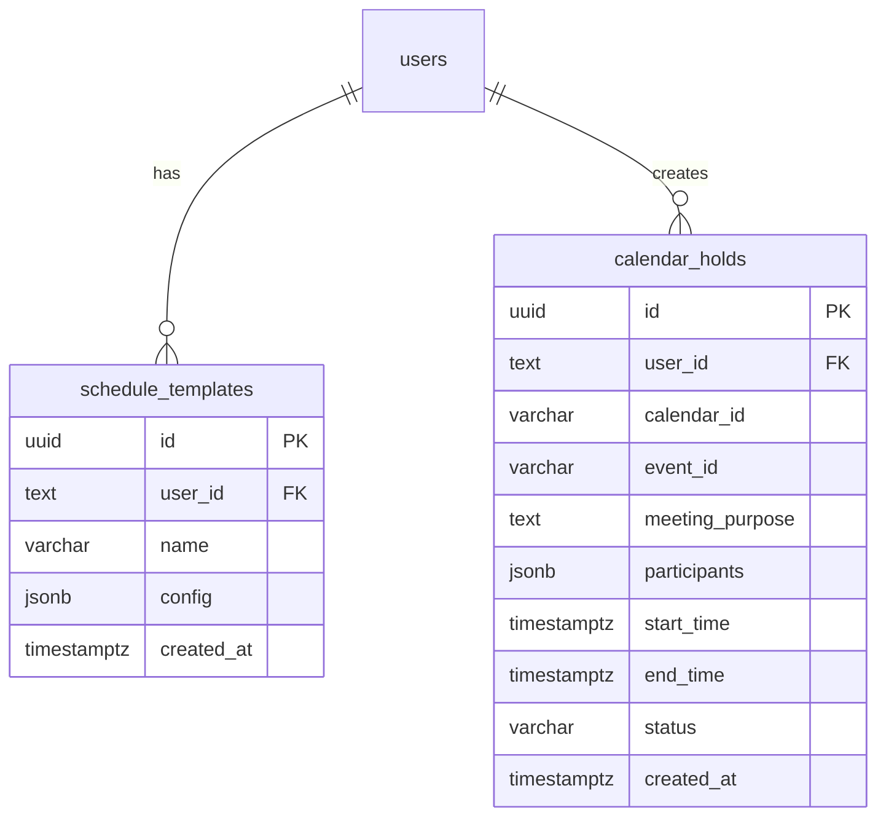

# feat: User Schedule Templates & Calendar Hold Tracking

> **Plan Review Status:** ✅ Reviewed by 3 specialized agents (DHH, Kieran, Simplicity)
> **Last Updated:** 2025-12-10
> **Revision:** 2.0 - Simplified based on reviewer feedback

## Overview

This plan covers four interconnected features to improve the CalFix scheduling experience:

1. **Fix Calendar Blocking Issue** - CRITICAL BUG - Holds don't block calendar time
2. **Calendar Holds Tracking** - Track all created holds in Supabase for management
3. **Active Holds Display** - Show current calendar holds on the Scheduling page
4. **User-Created Quick Schedule Templates** - Replace hardcoded quick buttons with user-saveable templates

## Problem Statement

### Current Issues

1. **Calendar Holds Don't Block Time** (CRITICAL BUG)
   - Current code at `src/pages/SchedulePage.tsx:724-774` adds `attendees` array
   - This creates meeting invites instead of blocking events
   - Events require acceptance to block calendar
   - Availability finder sees time as "free" - defeats purpose of holds

2. **No Hold Tracking**
   - Calendar holds created but not tracked in database
   - Cannot show users their active holds
   - No way to manage holds after creation

3. **Quick Schedule Buttons are Hardcoded** (`src/components/scheduling/QuickScheduleButtons.tsx`)
   - Three fixed templates: "This Week", "Next Week", "Coffee Chat"
   - No user customization or persistence
   - Users cannot save their preferred scheduling configurations

---

## Review Summary

### Reviewer Consensus

| Reviewer | Key Feedback | Action Taken |
|----------|-------------|--------------|
| **DHH** | "Extract first, then extend" - refactor before adding features | Added Phase 3 for extraction |
| **Kieran** | Transaction safety critical - need rollback for calendar+DB | Added detailed rollback patterns |
| **Simplicity** | Schema bloated by 40% - remove analytics/icons/ordering | Simplified to minimal fields |

### Key Changes Applied

1. **Template schema:** 14 → 5 DB columns (analytics/icons/ordering removed, full config in JSONB)
2. **Holds schema:** 15 → 10 fields (33% reduction)
3. **Removed:** analytics fields, icon picker, display ordering, soft delete
4. **TemplateConfig:** Full Step 1 state (participants, working hours, timezone guardrails)
5. **Added:** Transaction safety with rollback patterns
6. **Reordered:** Extract components BEFORE adding new features

---

## Proposed Solution

### Database Schema (SIMPLIFIED)



### Template Config Structure (FULL Step 1 State)

```typescript
// Save EVERYTHING from Step 1 - that's the whole point of templates
interface TemplateParticipant {
  displayName: string;
  email: string;
  timezone: string;
  startHour: string;        // e.g. "08:30"
  endHour: string;          // e.g. "17:30"
  sendInvite: boolean;
  role: 'host' | 'required' | 'optional';
  flexibleHours: boolean;
}

interface TemplateTimezoneGuardrail {
  timezone: string;
  label: string;
}

interface TemplateConfig {
  // Core scheduling parameters
  meetingPurpose: string;
  duration: number;           // minutes (30, 45, 60, 75, 90)
  searchWindowDays: number;   // days (7, 10, 14, 21, 30)

  // Participants with full working hours
  participants: TemplateParticipant[];

  // Timezone guardrails
  respectedTimezones: TemplateTimezoneGuardrail[];

  // Calendar selection (optional - defaults to user's primary)
  calendarId?: string;
}
```

**Why full config:**
- Templates should save ALL Step 1 inputs - that's their value
- Participants include working hours so availability search works correctly
- Timezone guardrails are part of the scheduling constraints
- User can always edit after loading a template

---

## Technical Approach

> **Provider-Agnostic Design Confirmed:** This implementation uses the existing `CalendarProvider` abstraction layer. The scheduling code calls `createProviderEvent()` which routes to either Google or Outlook based on the active provider. Both providers accept the same event format and handle `transparency: 'opaque'` to block calendar time.

### Phase 1: Fix Calendar Blocking Issue (CRITICAL)

**File:** `src/pages/SchedulePage.tsx:724-774`

**Current Code (WRONG):**
```typescript
const holds = selectedSlots.map((slot, index) => ({
  summary: holdTitles[index]?.trim() || fallbackTitle,
  // ...
  attendees,  // THIS IS THE PROBLEM
  colorId: '11',
  transparency: 'opaque'
}));
```

**Fixed Code (Works for Google AND Outlook):**
```typescript
const holds = selectedSlots.map((slot, index) => ({
  summary: holdTitles[index]?.trim() || fallbackTitle,
  description: `...`,
  start: { dateTime: slot.start.toISOString(), timeZone: hostTimezone },
  end: { dateTime: slot.end.toISOString(), timeZone: hostTimezone },
  // NO attendees - creates blocking event, not meeting invite
  // This works identically for both Google Calendar and Outlook
  transparency: 'opaque'  // Google uses colorId, Outlook maps to showAs='busy'
}));

// Uses provider abstraction - works for any provider
const createdEvent = await createProviderEvent(hold, managedCalendarId);
// createdEvent.id is available for tracking in both providers
```

**Provider Behavior:**
| Provider | Transparency Mapping | No Attendees Behavior |
|----------|---------------------|----------------------|
| Google Calendar | `transparency: 'opaque'` → busy | Personal event, no invites |
| Outlook/O365 | Maps to `showAs: 'busy'` | Personal event, no invites |

**Impact:** Calendar holds will immediately block time without requiring acceptance on BOTH Google and Outlook.

---

### Phase 2: Database Schema & Migration

**File:** `supabase/migrations/20251210000000_create_schedule_templates_and_holds.sql`

```sql
-- Enable UUID extension
CREATE EXTENSION IF NOT EXISTS "uuid-ossp";

-- Schedule Templates Table (MINIMAL - 5 columns)
CREATE TABLE schedule_templates (
  id UUID PRIMARY KEY DEFAULT uuid_generate_v4(),
  user_id TEXT NOT NULL,
  name VARCHAR(255) NOT NULL,
  config JSONB NOT NULL DEFAULT '{}'::jsonb,
  created_at TIMESTAMPTZ DEFAULT NOW(),

  CONSTRAINT unique_user_template_name UNIQUE(user_id, name)
);

-- Calendar Holds Table (MINIMAL - 10 columns)
CREATE TABLE calendar_holds (
  id UUID PRIMARY KEY DEFAULT uuid_generate_v4(),
  user_id TEXT NOT NULL,
  event_id VARCHAR(255) NOT NULL,
  calendar_id VARCHAR(255) NOT NULL,
  meeting_purpose TEXT NOT NULL,
  participants JSONB,
  start_time TIMESTAMPTZ NOT NULL,
  end_time TIMESTAMPTZ NOT NULL,
  status VARCHAR(50) DEFAULT 'active',
  created_at TIMESTAMPTZ DEFAULT NOW(),

  CONSTRAINT valid_status CHECK (status IN ('active', 'confirmed', 'canceled')),
  CONSTRAINT unique_event UNIQUE(calendar_id, event_id)
);

-- Minimal indexes only
CREATE INDEX idx_templates_user_id ON schedule_templates(user_id);
CREATE INDEX idx_holds_user_status ON calendar_holds(user_id, status);
CREATE INDEX idx_holds_event_id ON calendar_holds(event_id);
CREATE INDEX idx_holds_user_status_endtime ON calendar_holds(user_id, status, end_time);

-- RLS Policies
ALTER TABLE schedule_templates ENABLE ROW LEVEL SECURITY;
ALTER TABLE calendar_holds ENABLE ROW LEVEL SECURITY;

-- Templates policies
CREATE POLICY "Users can view own templates"
  ON schedule_templates FOR SELECT USING ((select auth.uid())::text = user_id);
CREATE POLICY "Users can insert own templates"
  ON schedule_templates FOR INSERT WITH CHECK ((select auth.uid())::text = user_id);
CREATE POLICY "Users can update own templates"
  ON schedule_templates FOR UPDATE USING ((select auth.uid())::text = user_id);
CREATE POLICY "Users can delete own templates"
  ON schedule_templates FOR DELETE USING ((select auth.uid())::text = user_id);

-- Holds policies
CREATE POLICY "Users can view own holds"
  ON calendar_holds FOR SELECT USING ((select auth.uid())::text = user_id);
CREATE POLICY "Users can insert own holds"
  ON calendar_holds FOR INSERT WITH CHECK ((select auth.uid())::text = user_id);
CREATE POLICY "Users can update own holds"
  ON calendar_holds FOR UPDATE USING ((select auth.uid())::text = user_id);
CREATE POLICY "Users can delete own holds"
  ON calendar_holds FOR DELETE USING ((select auth.uid())::text = user_id);
```

**Note:** Using `(select auth.uid())` pattern per Supabase RLS best practices for better performance.

---

### Phase 3: Extract SchedulePage Components (NEW - per DHH review)

> **Rationale:** SchedulePage.tsx is 1520 lines. Adding features will make it worse.
> Extract first, then extend.

**Phase 3A: Safe extraction (NEW components)**
These carry zero risk - they're additions, not modifications:

- `src/components/scheduling/ActiveHoldsSection.tsx`
- `src/components/scheduling/SaveTemplateModal.tsx`

**Phase 3B: Extract rendering from SchedulePage**
- `src/components/scheduling/ScheduleStep1.tsx` (lines 915-1057)
- `src/components/scheduling/ScheduleStep2.tsx` (lines 1143-1192)
- `src/components/scheduling/ScheduleStep3.tsx` (lines 1194-1280)

**Phase 3C: Extract state management (lower priority)**
- `src/hooks/useParticipants.ts`
- `src/hooks/useTimezoneGuardrails.ts`
- `src/hooks/useAvailabilitySearch.ts`

**Execution order:** 3A → 3B → 3C (safest to riskiest)

---

### Phase 4: TypeScript Types

**File:** `src/types/scheduling.ts`

```typescript
// ==========================================
// TEMPLATE TYPES - Full Step 1 State
// ==========================================

export interface TemplateParticipant {
  displayName: string;
  email: string;
  timezone: string;
  startHour: string;        // "HH:MM" format, e.g. "08:30"
  endHour: string;          // "HH:MM" format, e.g. "17:30"
  sendInvite: boolean;
  role: 'host' | 'required' | 'optional';
  flexibleHours: boolean;
}

export interface TemplateTimezoneGuardrail {
  timezone: string;
  label: string;
}

export interface TemplateConfig {
  // Core scheduling parameters
  meetingPurpose: string;
  duration: number;           // minutes (30, 45, 60, 75, 90)
  searchWindowDays: number;   // days (7, 10, 14, 21, 30)

  // Participants with full working hours
  participants: TemplateParticipant[];

  // Timezone guardrails
  respectedTimezones: TemplateTimezoneGuardrail[];

  // Calendar selection (optional - defaults to user's primary)
  calendarId?: string;
}

export interface ScheduleTemplate {
  id: string;
  user_id: string;
  name: string;
  config: TemplateConfig;
  created_at: string;
}

// ==========================================
// HOLD TYPES
// ==========================================

export interface HoldParticipant {
  email: string;
  name: string;
  timezone?: string;
  sendInvite?: boolean;
}

export interface CalendarHold {
  id: string;
  user_id: string;
  event_id: string;
  calendar_id: string;
  meeting_purpose: string;
  participants: HoldParticipant[] | null;
  start_time: string;
  end_time: string;
  status: 'active' | 'confirmed' | 'canceled';
  created_at: string;
}
```

---

### Phase 5: Custom Hooks with Transaction Safety

#### 5.1 useScheduleTemplates

**File:** `src/hooks/useScheduleTemplates.ts`

```typescript
import { useUser } from '@clerk/clerk-react';
import { useSupabaseClient } from '@/lib/supabase';
import { useState, useEffect, useCallback } from 'react';
import { ScheduleTemplate, TemplateConfig } from '@/types/scheduling';

export function useScheduleTemplates() {
  const { user } = useUser();
  const supabase = useSupabaseClient();
  const [templates, setTemplates] = useState<ScheduleTemplate[]>([]);
  const [isLoading, setIsLoading] = useState(true);
  const [error, setError] = useState<Error | null>(null);

  const fetchTemplates = useCallback(async () => {
    if (!user?.id) return;

    setIsLoading(true);
    try {
      const { data, error } = await supabase
        .from('schedule_templates')
        .select('*')
        .eq('user_id', user.id)
        .order('created_at', { ascending: false });

      if (error) throw error;
      setTemplates(data || []);
    } catch (err) {
      setError(err as Error);
    } finally {
      setIsLoading(false);
    }
  }, [user?.id]);  // Note: supabase NOT in deps (causes infinite loop)

  useEffect(() => {
    fetchTemplates();
  }, [fetchTemplates]);

  const createTemplate = async (name: string, config: TemplateConfig) => {
    if (!user?.id) throw new Error('Not authenticated');

    const { data, error } = await supabase
      .from('schedule_templates')
      .insert([{ user_id: user.id, name, config }])
      .select()
      .single();

    if (error) throw error;
    await fetchTemplates();
    return data;
  };

  const deleteTemplate = async (templateId: string) => {
    const { error } = await supabase
      .from('schedule_templates')
      .delete()
      .eq('id', templateId);

    if (error) throw error;
    await fetchTemplates();
  };

  return {
    templates,
    isLoading,
    error,
    createTemplate,
    deleteTemplate,
    refetch: fetchTemplates
  };
}
```

#### 5.2 useCalendarHolds (with Transaction Safety)

**File:** `src/hooks/useCalendarHolds.ts`

```typescript
import { useUser } from '@clerk/clerk-react';
import { useSupabaseClient } from '@/lib/supabase';
import { useState, useEffect, useCallback } from 'react';
import { CalendarHold, HoldParticipant } from '@/types/scheduling';
import { useCalendarProvider } from '@/context/CalendarProviderContext';

interface CreateHoldInput {
  event_id: string;
  calendar_id: string;
  meeting_purpose: string;
  participants: HoldParticipant[] | null;
  start_time: string;
  end_time: string;
}

export function useCalendarHolds() {
  const { user } = useUser();
  const supabase = useSupabaseClient();
  const { activeProvider } = useCalendarProvider();
  const [holds, setHolds] = useState<CalendarHold[]>([]);
  const [isLoading, setIsLoading] = useState(true);
  const [error, setError] = useState<Error | null>(null);

  const fetchHolds = useCallback(async () => {
    if (!user?.id) return;

    setIsLoading(true);
    try {
      const { data, error } = await supabase
        .from('calendar_holds')
        .select('*')
        .eq('user_id', user.id)
        .eq('status', 'active')
        .gte('end_time', new Date().toISOString())
        .order('start_time', { ascending: true });

      if (error) throw error;
      setHolds(data || []);
    } catch (err) {
      setError(err as Error);
    } finally {
      setIsLoading(false);
    }
  }, [user?.id]);

  useEffect(() => {
    fetchHolds();
  }, [fetchHolds]);

  // Single hold creation with DB tracking
  const createHold = async (hold: CreateHoldInput) => {
    if (!user?.id) throw new Error('Not authenticated');

    const { data, error } = await supabase
      .from('calendar_holds')
      .insert([{ ...hold, user_id: user.id, status: 'active' }])
      .select()
      .single();

    if (error) throw error;
    await fetchHolds();
    return data;
  };

  // Cancel hold: DB first (cheap), then calendar (can fail)
  // Per Kieran review: order matters for rollback
  const cancelHold = async (holdId: string) => {
    const hold = holds.find(h => h.id === holdId);
    if (!hold) throw new Error('Hold not found');

    // Step 1: Update DB first (easy to rollback)
    const { error: dbError } = await supabase
      .from('calendar_holds')
      .update({ status: 'canceled' })
      .eq('id', holdId);

    if (dbError) throw dbError;

    // Step 2: Delete calendar event
    try {
      await activeProvider.calendar.deleteEvent(hold.event_id, hold.calendar_id);
    } catch (calendarError) {
      // Rollback DB change
      await supabase
        .from('calendar_holds')
        .update({ status: 'active' })
        .eq('id', holdId);

      throw calendarError;
    }

    await fetchHolds();
  };

  return {
    holds,
    isLoading,
    error,
    createHold,
    cancelHold,
    refetch: fetchHolds
  };
}
```

---

### Phase 6: Hold Creation with Transaction Safety

**File:** `src/pages/SchedulePage.tsx` (modify existing `createCalendarHolds`)

```typescript
const createCalendarHolds = async () => {
  try {
    setLoading(true);

    // Phase 1: Create all calendar events, collect results
    const results: Array<{
      success: boolean;
      event?: any;
      error?: Error;
      index: number;
      slot: typeof selectedSlots[0];
    }> = [];

    for (let i = 0; i < selectedSlots.length; i++) {
      const slot = selectedSlots[i];
      const hold = {
        summary: holdTitles[i]?.trim() || `[Hold] ${meetingPurpose}`,
        description: `Calendar hold for: ${meetingPurpose}\n\nCreated via CalFix`,
        start: { dateTime: slot.start.toISOString(), timeZone: hostTimezone },
        end: { dateTime: slot.end.toISOString(), timeZone: hostTimezone },
        // NO attendees - creates blocking event, not meeting invite
        transparency: 'opaque'
      };

      try {
        const createdEvent = await createProviderEvent(hold, managedCalendarId);
        results.push({ success: true, event: createdEvent, index: i, slot });
      } catch (error) {
        results.push({
          success: false,
          error: error instanceof Error ? error : new Error(String(error)),
          index: i,
          slot
        });
      }
    }

    // Phase 2: Track successful holds in DB (batch insert)
    const successfulResults = results.filter(r => r.success);

    if (successfulResults.length === 0) {
      throw new Error('Failed to create any calendar holds');
    }

    const holdRecords = successfulResults.map(result => ({
      calendar_id: managedCalendarId,
      event_id: result.event.id,
      meeting_purpose: meetingPurpose,
      participants: participants.map(p => ({
        email: p.email,
        name: p.name,
        timezone: p.timezone,
        sendInvite: p.sendInvite
      })),
      start_time: result.slot.start.toISOString(),
      end_time: result.slot.end.toISOString()
    }));

    // Batch insert to Supabase
    const { error: dbError } = await supabase
      .from('calendar_holds')
      .insert(holdRecords);

    if (dbError) {
      // DB failed but calendar events exist - log for manual reconciliation
      console.error('[CRITICAL] Calendar events created but DB tracking failed:', dbError);
      setErrorMessage(
        `Calendar holds created but tracking failed. Events may appear in your calendar without tracking.`
      );
      // Still navigate - events were created successfully
    }

    // Show partial success feedback if needed
    const failedCount = results.length - successfulResults.length;
    if (failedCount > 0) {
      setErrorMessage(
        `Created ${successfulResults.length} holds successfully. ${failedCount} failed.`
      );
    }

    navigate('/dashboard');
  } catch (error) {
    console.error('Error creating calendar holds', error);
    setErrorMessage(error instanceof Error ? error.message : 'Unable to create holds.');
  } finally {
    setLoading(false);
  }
};
```

---

### Phase 7: UI Components

#### 7.1 ActiveHoldsSection

**File:** `src/components/scheduling/ActiveHoldsSection.tsx`

Simple inline list of active holds with cancel button. No separate HoldCard component needed.

#### 7.2 SaveTemplateModal

**File:** `src/components/scheduling/SaveTemplateModal.tsx`

Simple modal with name input only. No icon picker (use 📅 hardcoded).

---

## Execution Order

| Phase | Description | Risk | Depends On |
|-------|-------------|------|------------|
| **1** | Fix attendees bug (3 lines) | Low | None |
| **2** | Add database schema | Low | None |
| **3A** | Create new UI components | Low | None |
| **3B** | Extract Step1/2/3 from SchedulePage | Medium | 3A |
| **4** | Add TypeScript types | Low | 2 |
| **5** | Implement hooks with transaction safety | Medium | 2, 4 |
| **6** | Integrate hold creation with DB tracking | Medium | 5 |
| **7** | Add template saving UI | Low | 5, 3A |

**Recommended ship order:**
1. Phase 1 + 2 (bug fix + schema) - deploy immediately
2. Phase 4 + 5 (types + hooks) - core functionality
3. Phase 6 (integration) - connect everything
4. Phase 3A + 7 (UI components) - user-facing features
5. Phase 3B (extraction) - tech debt cleanup

---

## Acceptance Criteria

### Feature 1: Fix Calendar Blocking (P0)

- [ ] Calendar holds created WITHOUT attendees array
- [ ] Events immediately block calendar (no acceptance required)
- [ ] `transparency: "opaque"` ensures busy status
- [ ] Works on BOTH Google Calendar and Outlook

### Feature 2: Calendar Holds Tracking (P1)

- [ ] All created holds stored in Supabase `calendar_holds` table
- [ ] Holds include: event_id, calendar_id, meeting_purpose, participants, times
- [ ] Batch insert for multiple holds
- [ ] Partial failure handling with user feedback

### Feature 3: Active Holds Display (P1)

- [ ] Active holds shown on Scheduling page
- [ ] Each hold displays: purpose, time, participant count
- [ ] "Cancel" button deletes calendar event and updates DB
- [ ] Holds auto-filter when end_time passes

### Feature 4: Quick Schedule Templates (P2)

- [ ] Users can save current Step 1 configuration as named template
- [ ] Templates stored in Supabase with RLS
- [ ] Show saved templates in quick buttons area
- [ ] Users can delete their templates
- [ ] Templates load configuration into Step 1 when selected

---

## Files to Create/Modify

### New Files
- `supabase/migrations/20251210000000_create_schedule_templates_and_holds.sql`
- `src/types/scheduling.ts`
- `src/hooks/useScheduleTemplates.ts`
- `src/hooks/useCalendarHolds.ts`
- `src/components/scheduling/ActiveHoldsSection.tsx`
- `src/components/scheduling/SaveTemplateModal.tsx`
- `src/components/scheduling/ScheduleStep1.tsx` (extraction)
- `src/components/scheduling/ScheduleStep2.tsx` (extraction)
- `src/components/scheduling/ScheduleStep3.tsx` (extraction)

### Modified Files
- `src/pages/SchedulePage.tsx` - Fix attendees bug, add hold tracking
- `src/components/scheduling/QuickScheduleButtons.tsx` - Load user templates

---

## Testing Plan

### Pre-Deploy (local checks)
- [ ] TypeScript compiles without errors: `npm run build`
- [ ] No linting errors: `npm run lint`
- [ ] Migration SQL is valid syntax

### Vercel Testing (required)
- [ ] Create calendar holds - verify they block time immediately
- [ ] Check Supabase - verify holds tracked in database
- [ ] Cancel a hold - verify calendar event deleted AND DB updated
- [ ] Save a template - verify it appears in list
- [ ] Load a template - verify Step 1 populates correctly
- [ ] Delete a template - verify it's removed
- [ ] Partial failure: Test with invalid calendar ID - verify feedback

### Edge Cases
- [ ] Create 5 holds, 1 fails - shows "4 succeeded, 1 failed"
- [ ] DB insert fails after calendar success - shows warning
- [ ] Cancel hold when calendar token expired - shows reconnect prompt
- [ ] Template with 0 duration (invalid) - validation error

---

## Risk Analysis

| Risk | Impact | Mitigation |
|------|--------|------------|
| Calendar succeeds, DB fails | Orphaned events | Log error, show warning, user can manually delete |
| DB succeeds, calendar fails | Orphaned DB records | Rollback pattern implemented in cancelHold |
| User loses calendar access | Cannot cancel holds | Check permissions, show reconnect prompt |
| Partial hold creation | Inconsistent state | Collect all results first, show partial success UI |

---

## Deferred Features (per reviewer feedback)

The following were identified as YAGNI and removed from v1:

| Feature | Reason | If Needed Later |
|---------|--------|-----------------|
| Template icons | Pure decoration | Add `icon` column, simple emoji picker |
| Usage analytics | Nobody asked for it | Add `usage_count`, `last_used_at` columns |
| Display ordering | Premature | Add `display_order` column, drag-drop UI |
| Template descriptions | Name is sufficient | Add `description` column |
| Soft delete | Adds complexity | Add `is_active` column |
| confirmHold | Over-complicated | Just delete holds, let user recreate as meeting |
| Guardrails storage | Historical data unused | Add `guardrails JSONB` column |

---

## References

### Internal Files
- `src/pages/SchedulePage.tsx:724-774` - Current hold creation (has attendees bug)
- `src/components/scheduling/QuickScheduleButtons.tsx` - Current hardcoded templates
- `src/services/providers/google/calendar.ts` - Google Calendar API integration
- `src/services/providers/outlook/calendar.ts` - Outlook Calendar API integration
- `src/context/CalendarProviderContext.tsx` - Provider abstraction layer
- `src/lib/supabase.ts` - Supabase client with Clerk auth

### External Documentation
- [Google Calendar API - Create Events](https://developers.google.com/workspace/calendar/api/guides/create-events)
- [Supabase RLS Best Practices](https://supabase.com/docs/guides/auth/row-level-security)
